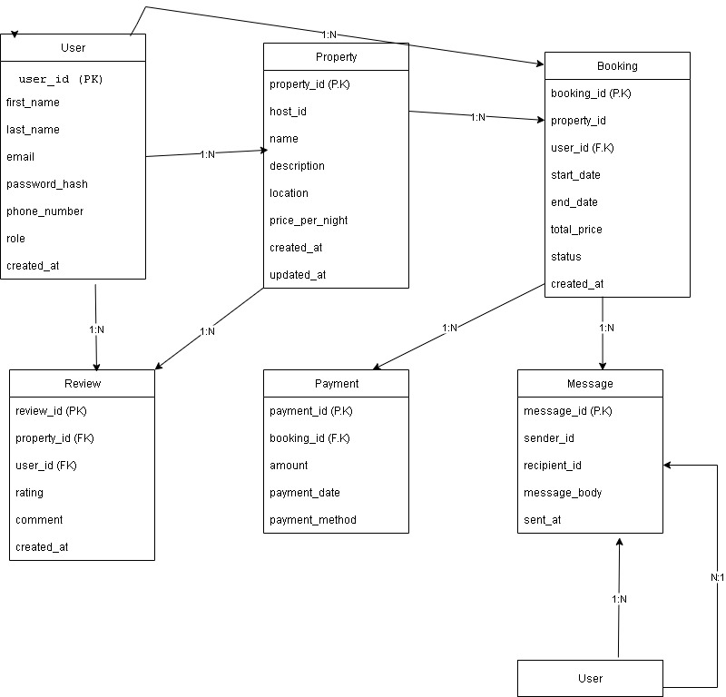

# Entities and Attributes

### 1. User Entity
- **user_id** (PK, UUID)
- **first_name** (VARCHAR, NOT NULL)
- **last_name** (VARCHAR, NOT NULL)
- **email** (VARCHAR, UNIQUE, NOT NULL)
- **password_hash** (VARCHAR, NOT NULL)
- **phone_number** (VARCHAR, NULL)
- **role** (ENUM: guest, host, admin, NOT NULL)
- **created_at** (TIMESTAMP, DEFAULT)

### 2. Property Entity
- **property_id** (PK, UUID)
- **host_id** (FK → User)
- **name** (VARCHAR, NOT NULL)
- **description** (TEXT, NOT NULL)
- **location** (VARCHAR, NOT NULL)
- **price_per_night** (DECIMAL, NOT NULL)
- **created_at** (TIMESTAMP, DEFAULT)
- **updated_at** (TIMESTAMP, ON UPDATE)

### 3. Booking Entity
- **booking_id** (PK, UUID)
- **property_id** (FK → Property)
- **user_id** (FK → User)
- **start_date** (DATE, NOT NULL)
- **end_date** (DATE, NOT NULL)
- **total_price** (DECIMAL, NOT NULL)
- **status** (ENUM: pending, confirmed, canceled, NOT NULL)
- **created_at** (TIMESTAMP, DEFAULT)

### 4. Payment Entity
- **payment_id** (PK, UUID)
- **booking_id** (FK → Booking)
- **amount** (DECIMAL, NOT NULL)
- **payment_date** (TIMESTAMP, DEFAULT)
- **payment_method** (ENUM: credit_card, paypal, stripe, NOT NULL)

### 5. Review Entity
- **review_id** (PK, UUID)
- **property_id** (FK → Property)
- **user_id** (FK → User)
- **rating** (INTEGER, 1-5, NOT NULL)
- **comment** (TEXT, NOT NULL)
- **created_at** (TIMESTAMP, DEFAULT)

### 6. Message Entity
- **message_id** (PK, UUID)
- **sender_id** (FK → User)
- **recipient_id** (FK → User)
- **message_body** (TEXT, NOT NULL)
- **sent_at** (TIMESTAMP, DEFAULT)

## Relationships

### User → Property (One-to-Many)
- A user (host) can own multiple properties
- A property belongs to one host

### User → Booking (One-to-Many)
- A user can make multiple bookings
- A booking belongs to one user

### Property → Booking (One-to-Many)
- A property can have multiple bookings
- A booking is for one property

### Booking → Payment (One-to-One/One-to-Many)
- A booking can have one or more payments
- A payment belongs to one booking

### User → Review (One-to-Many)
- A user can write multiple reviews
- A review is written by one user

### Property → Review (One-to-Many)
- A property can have multiple reviews
- A review is for one property

### User → Message (Self-referencing Many-to-Many)
- A user can send multiple messages
- A user can receive multiple messages
- A message has one sender and one recipient

## ER Diagram Representation
